# Module 2 — Analytics Pipeline

## Run order

1. `python analytics/01_eda.py` loads Titanic once with `sns.load_dataset('titanic')`, saves `titanic.csv` immediately, profiles it, applies the missing-value threshold rule, performs EDA, and saves `cleaned_titanic.csv`.
2. `python analytics/02_modeling.py` reads `cleaned_titanic.csv` with `pd.read_csv` and continues the same cleaned-data story into classification, imbalance handling, tuning, regression, and artifact saving.

## Dataset profile

Raw shape: **(891, 15)**.

### Missing values and threshold decisions

| Column | Missing count | Missing % | Decision |
|---|---:|---:|---|
| age | 177 | 19.87% | 19.87% in [5%, 30%]: median-impute age (median=28.00). |
| deck | 688 | 77.22% | 77.22% > 30%: drop column deck because imputation would be unreliable. |
| embark_town | 2 | 0.22% | 0.22% < 5%: drop rows with missing embark_town. |
| embarked | 2 | 0.22% | 0.22% < 5%: drop rows with missing embarked. |

High-missing `deck` is dropped because its missingness exceeds 30%, while `age` is median-imputed because its missingness lies between 5% and 30%. Columns below 5% missingness are handled by dropping the affected rows, exactly following the project threshold rule.

## Univariate analysis

Age IQR outlier count: **65**.
Fare IQR outlier count: **114**.
Fare mean = **32.097**, median = **14.454**, mode = **8.050**. Because mean > median > mode, fare is interpreted as **right-skewed** rather than symmetric.

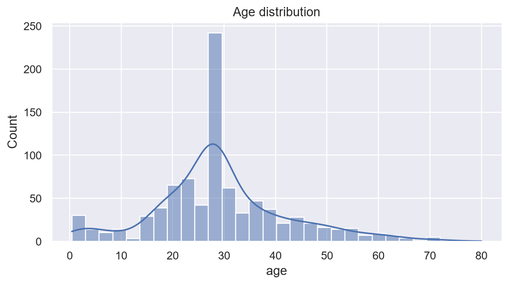

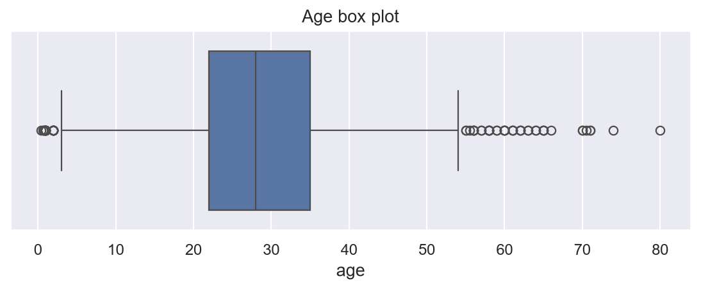

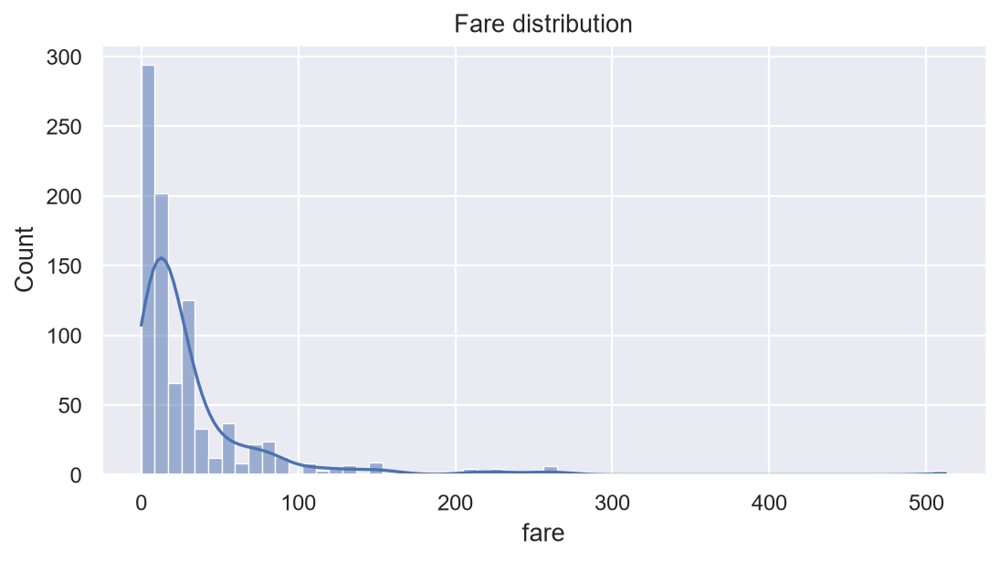

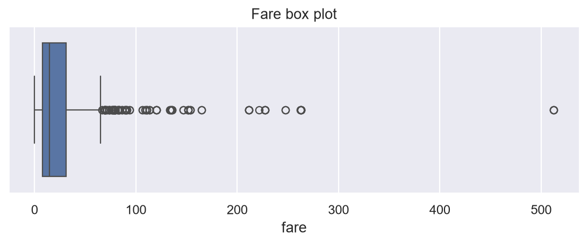

## Bivariate analysis

### Survival by sex

|        |   survival_rate |
|:-------|----------------:|
| female |          0.7404 |
| male   |          0.1889 |

The sex breakdown shows a substantial difference in observed survival rate between the two sex groups. The calculation uses boolean masking and then divides survivors by group size, so the reported values are proportions rather than raw counts.

### Survival by passenger class

|    |   survival_rate |
|---:|----------------:|
|  1 |          0.6262 |
|  2 |          0.4728 |
|  3 |          0.2424 |

Passenger class is associated with survival in the cleaned data, with the rates differing across first, second, and third class. This is descriptive evidence of an association, not a causal claim.

### Survival by sex and passenger class

|               |   survival_rate |
|:--------------|----------------:|
| ('female', 1) |          0.9674 |
| ('female', 2) |          0.9211 |
| ('female', 3) |          0.5    |
| ('male', 1)   |          0.3689 |
| ('male', 2)   |          0.1574 |
| ('male', 3)   |          0.1354 |

The joint breakdown shows that sex differences persist within passenger classes, while passenger class also changes the survival rate inside each sex group. The combination is more informative than either single-variable breakdown because it exposes the interaction-like pattern directly.

### Correlation matrix

The heatmap uses exactly `survived`, `pclass`, `age`, `sibsp`, `parch`, and `fare`. Boolean-derived flags such as `adult_male` and `alone` are intentionally excluded because the project specifies that they are redundant flags rather than independent measured features.

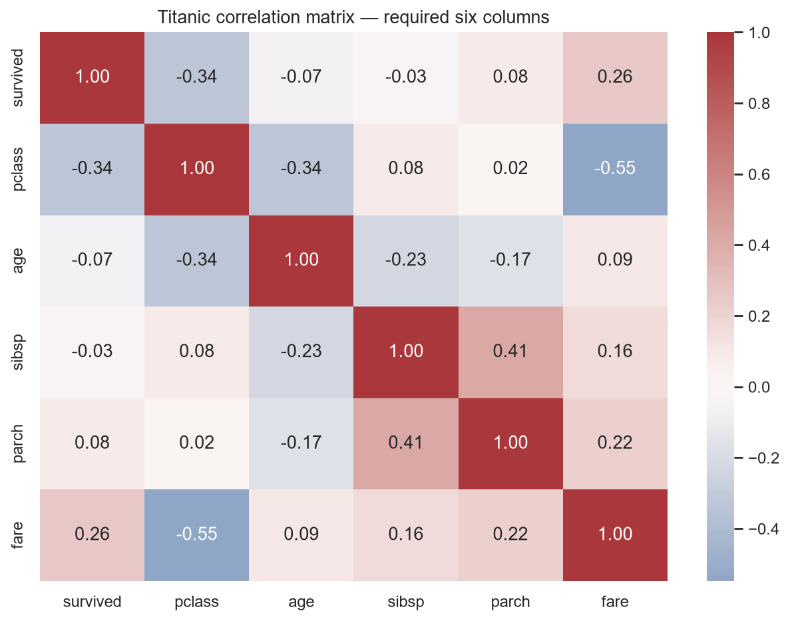

The two strongest off-diagonal correlations by absolute magnitude are:
- `pclass` vs `fare`: correlation = **-0.5482**.
- `sibsp` vs `parch`: correlation = **0.4145**.

The sign indicates direction while the absolute value determines the requested ranking. These correlations describe pairwise linear association only and do not establish causality.

## Multivariate data story

### Chart 1 — Survival rate by sex

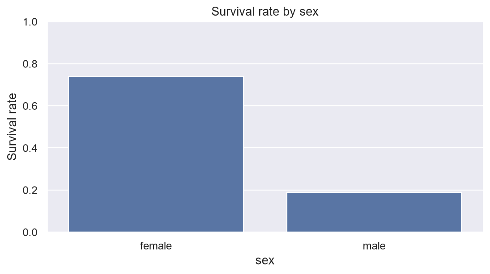

The bar chart makes the sex-based survival difference visible at a glance. The group percentages complement the bivariate table and provide a clear first part of the survival story.

### Chart 2 — Survival rate by passenger class

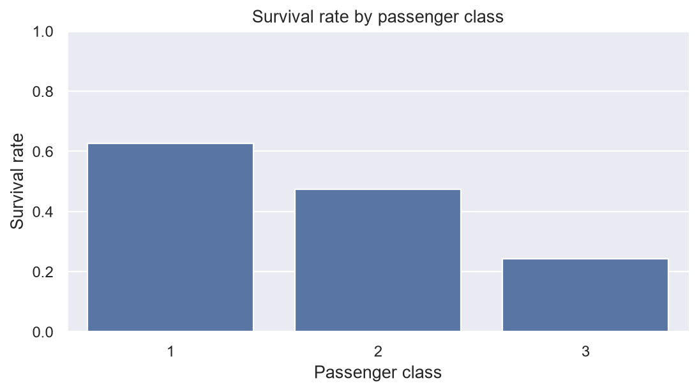

Survival rates vary across passenger classes, showing that class was an important descriptive feature in this dataset. The visual makes the class gradient easier to compare than the raw table alone.

### Chart 3 — Survival by sex and class

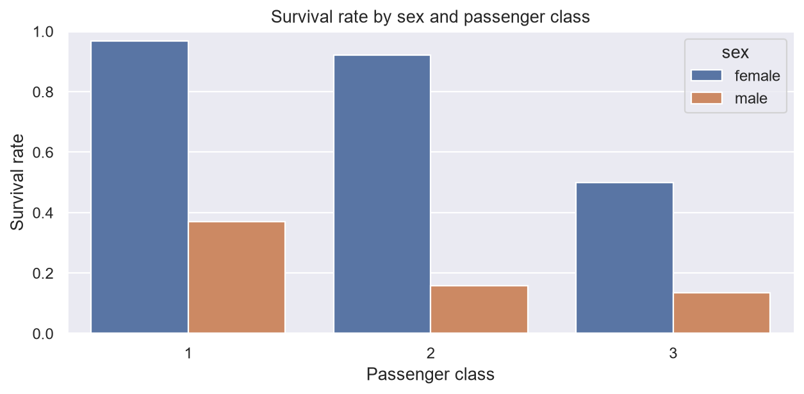

The grouped bars show how sex and passenger class jointly relate to survival. Within-class comparisons and within-sex comparisons can both be read directly from the same chart.

### Chart 4 — Fare distribution by survival

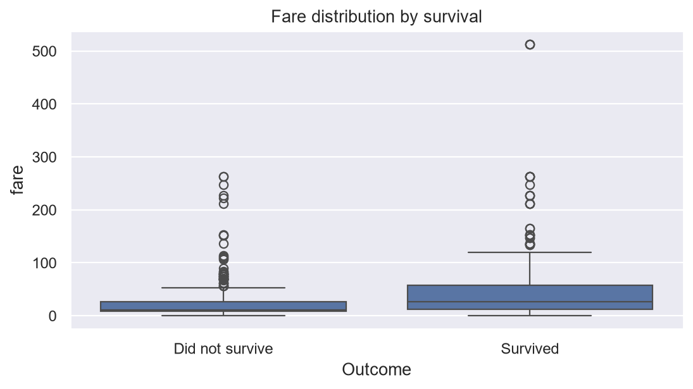

The fare box plot compares the fare distributions for survivors and non-survivors. It helps connect monetary/class-related information to survival without treating fare as the sole explanation for the outcome.

### Chart 5 — Age vs fare by survival

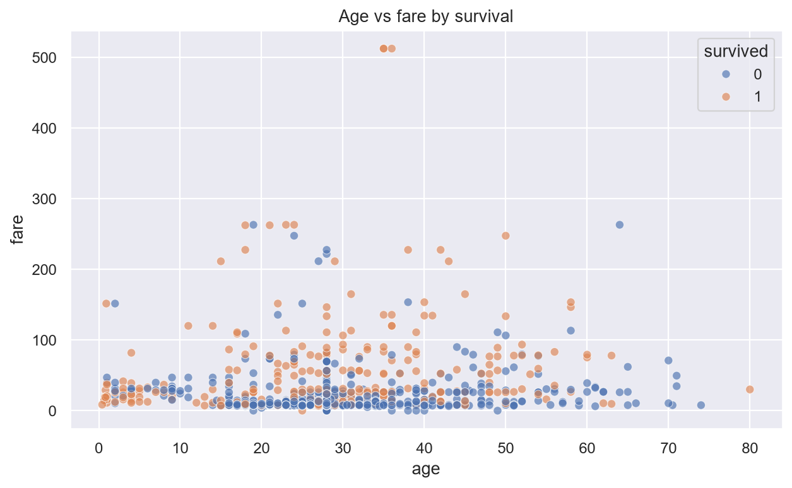

The scatter plot combines age and fare with survival as the visual grouping variable. It shows overlap between groups while also making the class/fare structure of the dataset visible.

## Exploratory standardization sanity check

Age and fare are standardized only for this EDA-stage check; these transformed columns are not reused as model inputs. The model section performs its own train-only preprocessing through scikit-learn pipelines.

| column   |   mean_after |   std_after_ddof0 |
|:---------|-------------:|------------------:|
| age_z    |  2.71749e-16 |                 1 |
| fare_z   |  1.39871e-16 |                 1 |

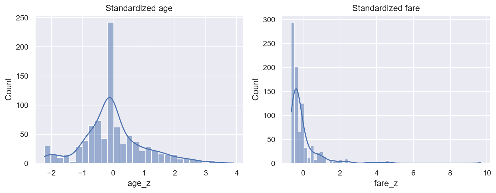

## Interpretation and modeling continuation

The EDA establishes the data-quality decisions and descriptive patterns before any predictive model is fitted. The next step is to use a stratified train/test split and fit every preprocessing object only on training data through a `Pipeline`/`ColumnTransformer`, preventing test-set leakage as required by the project.
# Predictive Modeling Results

## Train/test split and leakage control

The cleaned dataset contains **889 rows**. A stratified 80%/20% train/test split with `random_state=42` preserves the observed survived/not-survived class proportions between train and test. Preprocessing uses `Pipeline` + `ColumnTransformer`: numeric features are median-imputed and standardized, while `sex` and `embarked` are most-frequent imputed and one-hot encoded. These transformers are fit only inside the training step of each pipeline, then reused in transform-only mode on held-out data.

## Classification class balance

|   survived |   count |   percentage |
|-----------:|--------:|-------------:|
|          0 |     439 |        61.74 |
|          1 |     272 |        38.26 |

Stratification matters because the target classes are not exactly equal in the Titanic data. Keeping the class proportions similar in train and test makes the held-out metrics more representative of the same target mix used for training.

## Classifier comparison

| model               |   accuracy |   precision |   recall |     f1 |    auc |
|:--------------------|-----------:|------------:|---------:|-------:|-------:|
| Logistic Regression |     0.809  |      0.7833 |   0.6912 | 0.7344 | 0.861  |
| Decision Tree       |     0.764  |      0.76   |   0.5588 | 0.6441 | 0.8374 |
| Random Forest       |     0.8034 |      0.7619 |   0.7059 | 0.7328 | 0.8237 |

## Combined model comparison table

The table below keeps classification and regression metrics as separate column groups. `—` means the metric family does not apply to that model type.

| model_type     | model                    | accuracy   | precision   | recall   | f1     | auc    | MAE     | RMSE    | R2     | Adjusted_R2   |
|:---------------|:-------------------------|:-----------|:------------|:---------|:-------|:-------|:--------|:--------|:-------|:--------------|
| classification | Logistic Regression      | 0.809      | 0.7833      | 0.6912   | 0.7344 | 0.861  | —       | —       | —      | —             |
| classification | Decision Tree            | 0.764      | 0.76        | 0.5588   | 0.6441 | 0.8374 | —       | —       | —      | —             |
| classification | Random Forest            | 0.8034     | 0.7619      | 0.7059   | 0.7328 | 0.8237 | —       | —       | —      | —             |
| regression     | Linear Regression (fare) | —          | —           | —        | —      | —      | 19.7531 | 41.2701 | 0.3471 | 0.3081        |

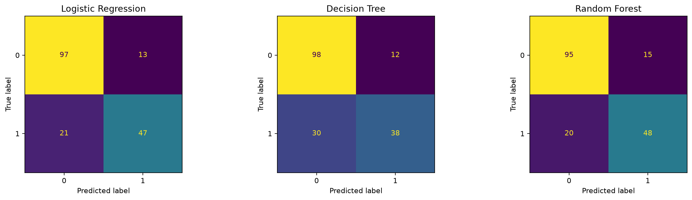

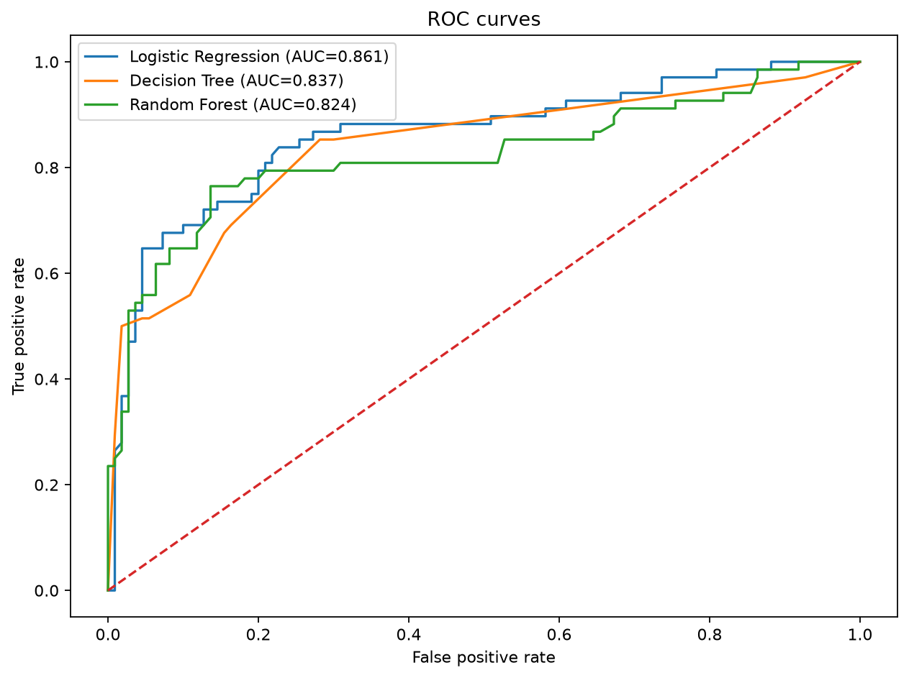

The confusion matrices show the error counts for each classifier on the same stratified test split. The ROC plot compares ranking quality across thresholds through AUC, while the table reports fixed-threshold classification metrics.

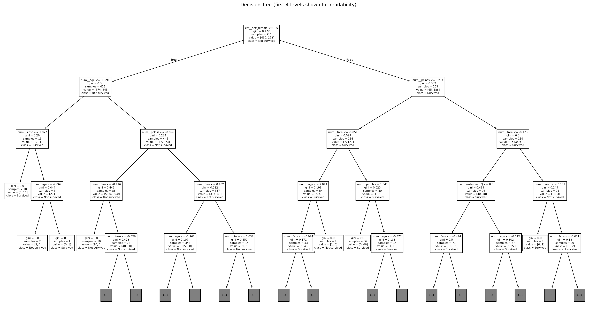

The decision tree visualization labels the transformed feature names and the two output classes. Only the first four levels are displayed to keep the chart readable while still exposing the learned split structure.

## Imbalance handling comparison

| strategy              |   precision |   recall |     f1 |
|:----------------------|------------:|---------:|-------:|
| baseline              |      0.7619 |   0.7059 | 0.7328 |
| class_weight=balanced |      0.7536 |   0.7647 | 0.7591 |
| SMOTE(training only)  |      0.7612 |   0.75   | 0.7556 |

Across the three variants, **class_weight=balanced** has the highest F1 score in this run (0.759). The baseline is a reference point, `class_weight='balanced'` changes the estimator's class weighting, and SMOTE creates synthetic minority examples only inside the training pipeline so test information is not used to create synthetic samples.

## Random Forest hyperparameter tuning

Best parameters: **{'classifier__max_depth': 5, 'classifier__max_features': 'sqrt', 'classifier__n_estimators': 200}**.
Best cross-validation score (F1): **0.7408**.
Refitted best estimator OOB score: **0.8214**.

The Random Forest estimator is explicitly created with `oob_score=True`, so the refitted best estimator exposes `oob_score_`. The grid search itself is wrapped around the complete preprocessing + estimator pipeline, preventing preprocessing leakage during cross-validation.

## Regression side-task — predict fare

MAE: **19.7531**  
RMSE: **41.2701**  
R²: **0.3471**  
Adjusted R²: **0.3081**

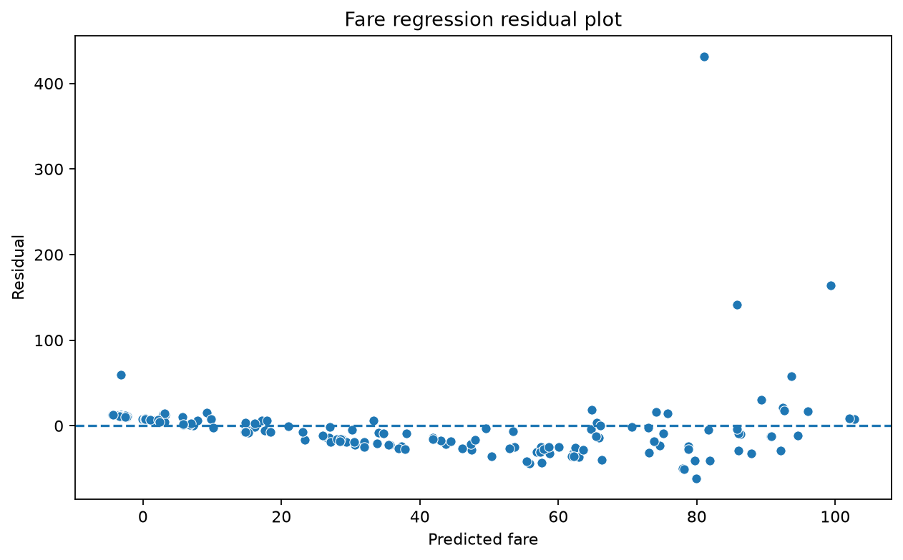

The residual-vs-predicted diagnostic is flagged as **showing evidence of heteroscedasticity** by the simple absolute-residual/predicted-value correlation check implemented in the script. The plot should be inspected alongside this numeric flag because the visual pattern, not the threshold alone, is the diagnostic of interest.

## Final model decision

The classifier selected for deployment is **Logistic Regression** because it has the highest test-set F1 score among the three baseline classifiers in this run (0.734). Its accuracy is 0.809, precision is 0.783, recall is 0.691, and AUC is 0.861. This choice is based on the observed held-out metrics rather than a single training score. The saved artifact is the complete fitted pipeline, so its preprocessing and estimator can be applied together to raw rows at inference time.

### Classification and regression metrics are separate groups

Classifier metrics (accuracy, precision, recall, F1, AUC) describe classification performance, while MAE, RMSE, R², and Adjusted R² describe regression performance. They are intentionally reported as separate metric groups and are not treated as directly comparable numbers.

## Saved complete pipeline

`artifacts/best_classifier_pipeline.joblib` contains the preprocessing transformer(s) and final classifier together. The script reloads this object with `joblib.load` and predicts directly from a raw, unpreprocessed feature row.

Reload check prediction for one held-out raw row: **0**.
